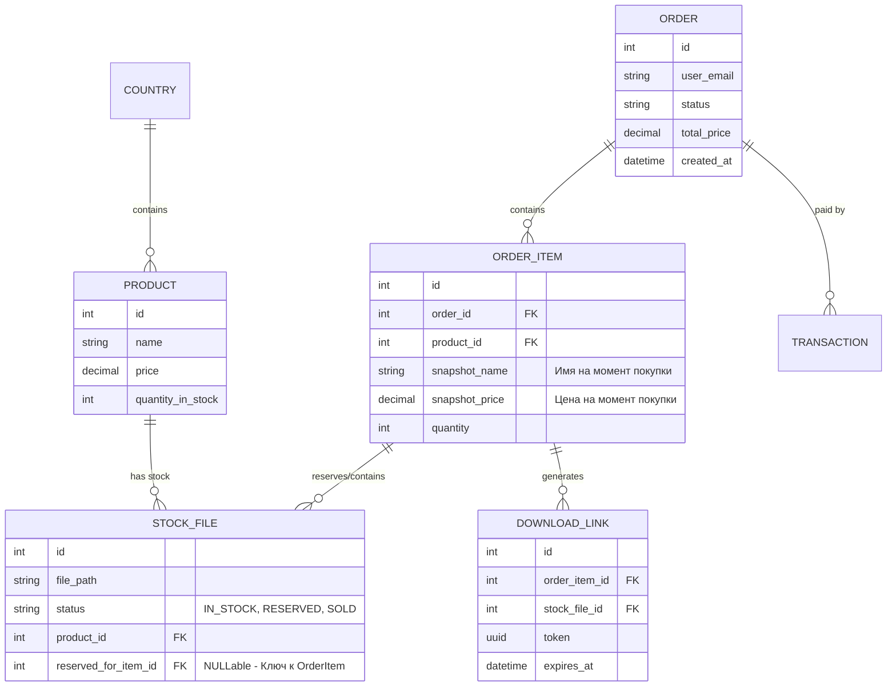
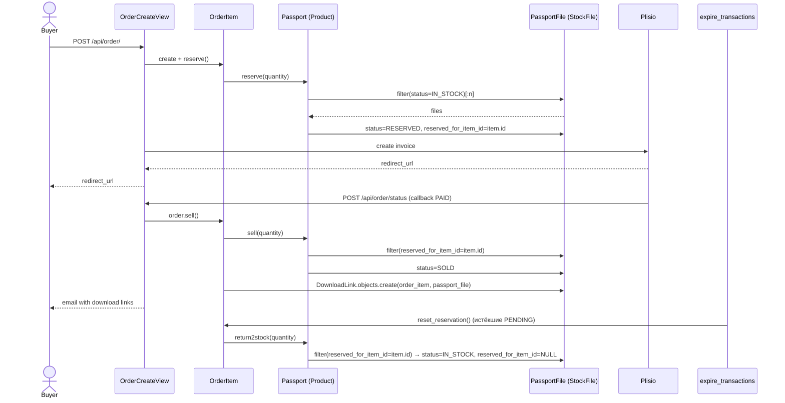

# Вариант 1: Атомарное резервирование (Atomic Link)

Этот вариант фокусируется на устранении главной проблемы — "кражи" резервов между заказами. Мы связываем конкретные файлы с конкретным заказом в момент его создания.

## Схема (Mermaid)

## Обоснование
Основное изменение — добавление `reserved_for_item_id` в таблицу файлов (`PassportFile` в текущей коде). Теперь метод `reserve()` не просто меняет статус, а "метит" файл идентификатором позиции заказа. 

Также добавлены `snapshot_name` и `snapshot_price` в `OrderItem`, чтобы при изменении товара в админке история заказов оставалась корректной.

## Потоки (sequence)

## Как работают сервисы

Изменения точечные — меняется **выборка**, а не структура вызовов:

- `Passport.reserve(count)` (`backend/passport/models.py:64`): вместо `self.files.filter(status=IN_STOCK)[:count]` без метки — те же файлы, но `bulk_update` дополнительно проставляет `reserved_for_item_id=<id этого OrderItem>`. Метод должен принимать `order_item` (или вызываться из `OrderItem.reserve()` с `self`), а не только `count`.
- `Passport.return2stock(count)` и `Passport.sell(count)`: фильтр меняется с "первые N `RESERVED`" на "`RESERVED` AND `reserved_for_item_id=order_item.id`" — так `sell()`/`return2stock()` гарантированно трогают только файлы этого конкретного заказа, а не случайные `RESERVED` файлы другого покупателя.
- `OrderItem.reserve/sell/reset_reservation` (`backend/order/models.py:80-112`): сигнатуры не меняются, просто передают `self` в методы `Passport`, чтобы туда попал `order_item_id`.
- `DownloadLink`: без изменений — уже связывает `order_item` и конкретный `passport_file`, сейчас это единственное место, где связь `файл ↔ заказ` вообще существует.
- Гонка (race) между двумя `OrderItem` за один и тот же `Passport`: нужен `select_for_update()` внутри `@atomic` при выборке `IN_STOCK`-файлов, иначе `reserved_for_item_id` может быть перезаписан вторым конкурентным `reserve()` до коммита первого.

## Плюсы и Минусы

### Плюсы
*   **Исключены гонки (Race Conditions):** Невозможно продать один и тот же зарезервированный файл двум разным людям.
*   **Целостность истории:** Заказ сохраняет цену и название товара на момент покупки.
*   **Простота отмены:** Если заказ истек, мы просто находим все файлы с `reserved_for_item_id == order_item.id` и освобождаем их.
*   **Прозрачность:** В любой момент понятно, какой файл "ждет" оплаты в каком заказе.

### Минусы
*   **Прямая зависимость:** Таблица файлов теперь "знает" о заказах, что немного нарушает чистоту слоев (Inventory знает об Orders).
*   **Сложность bulk-операций:** Требуется аккуратное обновление статусов при массовых заказах.

### Честный вердикт
Это самый быстрый и надежный способ исправить текущую ситуацию с минимальными изменениями в логике. Идеально подходит для текущего масштаба проекта.
