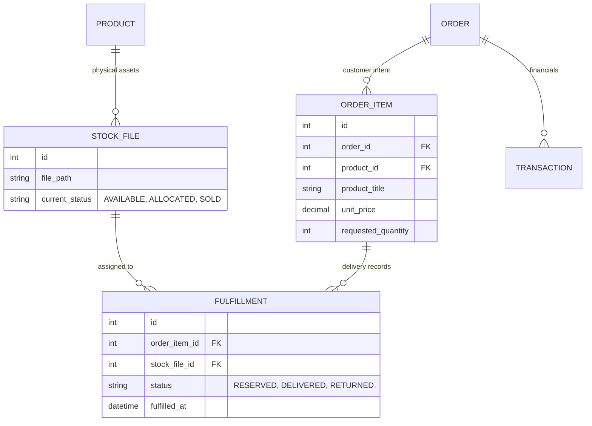
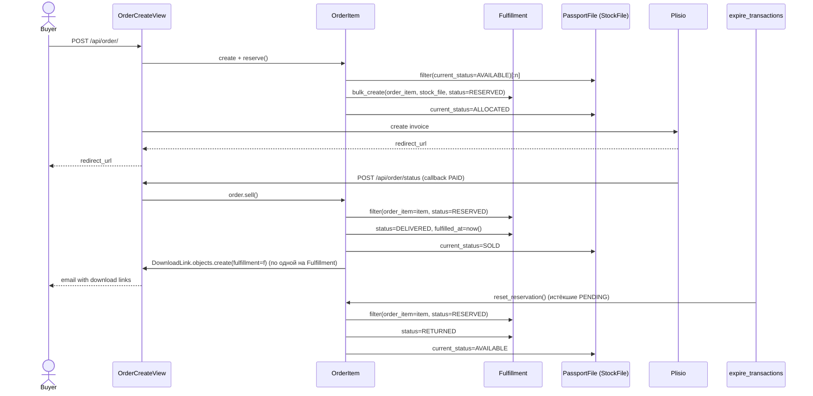

# Вариант 2: Таблица исполнения (Fulfillment & Audit)

Этот вариант разделяет понятия "Заказ" и "Выдача товара" через промежуточную сущность. Это классический подход для E-commerce систем.

## Схема (Mermaid)

## Обоснование
Вместо того чтобы захламлять таблицу файлов ссылками на заказы, мы создаем таблицу `FULFILLMENT`. 
1. При создании заказа создаются записи в `FULFILLMENT` со статусом `RESERVED`.
2. После оплаты статус меняется на `DELIVERED`.
3. Ссылки на скачивание генерируются на основе записей в `FULFILLMENT`.

## Потоки (sequence)

## Как работают сервисы

Здесь меняется не выборка, а **владелец состояния**: `PassportFile` перестаёт знать про `RESERVED`/`SOLD` детально — им управляет `Fulfillment`.

- `Passport.reserve(count)`: больше не пишет статус на `PassportFile` напрямую. Вместо `bulk_update(files, ["status"])` — `Fulfillment.objects.bulk_create([Fulfillment(order_item=item, stock_file=f, status=RESERVED) for f in files])`, и уже `Fulfillment.save()`/сигнал переводит `PassportFile.current_status` в `ALLOCATED`. Метод должен принять `order_item`, а не быть чистым методом `Passport`.
- `Passport.return2stock` / `Passport.sell`: вместо фильтра по `PassportFile.status` — фильтр по `Fulfillment.objects.filter(order_item=item, status=RESERVED)`, дальше апдейт статуса `Fulfillment` (`RETURNED`/`DELIVERED`) плюс синхронный апдейт `PassportFile.current_status`. Два объекта обновляются в одной транзакции — источник дополнительной сложности, о котором предупреждает раздел "Минусы".
- `Passport.quantity` (denormalized `IN_STOCK`-счётчик, `passport/signals.py`): сигнал нужно перевесить с `post_save/post_delete` на `PassportFile`, на изменения `Fulfillment` **плюс** `PassportFile.current_status == AVAILABLE` — то есть точка истины для "сколько в наличии" переезжает.
- `DownloadLink`: FK меняется с `passport_file` на `fulfillment` (или добавляется `fulfillment_id` рядом) — так у каждой ссылки есть аудиторская запись "когда именно выдали".
- Плюс аудита: `Fulfillment` не удаляется даже если `PassportFile` физически убрали из системы (`on_delete=SET_NULL` на `stock_file`) — история покупки не теряется.

## Плюсы и Минусы

### Плюсы
*   **Чистота данных:** Таблица файлов остается независимой (Inventory отделен от Orders).
*   **Аудит:** У вас есть полная история: кто, когда и какой именно файл получил. Даже если файл будет удален из системы, запись в Fulfillment останется.
*   **Гибкость:** Позволяет легко реализовать частичный возврат или замену конкретного файла в заказе.
*   **Масштабируемость:** Удобно для аналитики (сколько товаров в резерве, какая скорость оборачиваемости).

### Минусы
*   **Больше таблиц:** Нужно поддерживать еще одну сущность и следить за синхронизацией статусов между `STOCK_FILE` и `FULFILLMENT`.
*   **Сложнее запросы:** Чтобы получить ссылку на файл, нужно пройти через цепочку Order -> OrderItem -> Fulfillment -> StockFile.

### Честный вердикт
Лучший выбор, если вы планируете расширять бизнес, добавлять отчетность или если вам критически важна юридическая точность (кто именно что получил).
