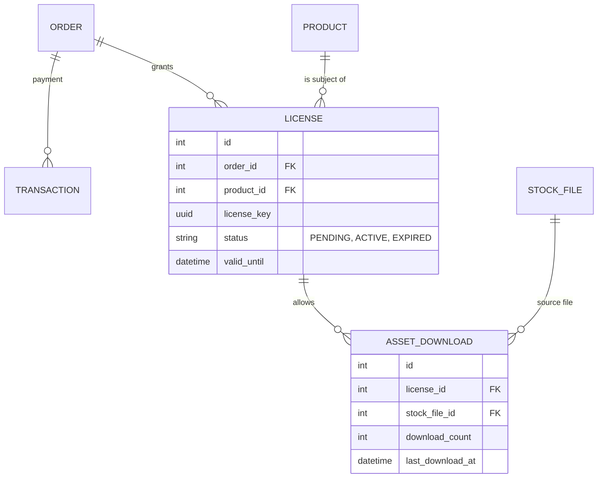
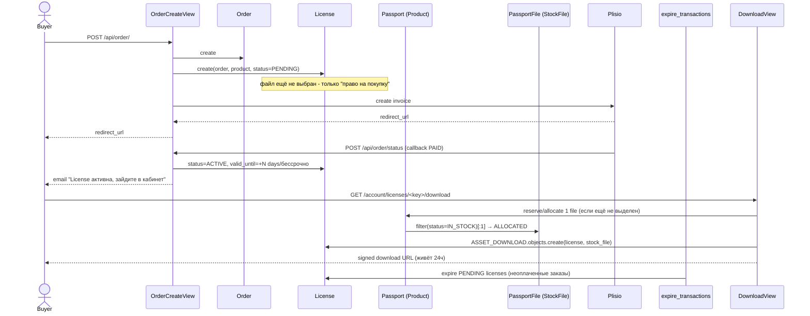

# Вариант 3: Модель Лицензий (Digital Asset Management)

Подход, при котором пользователь покупает не "файл", а "Лицензию" (Право на доступ) к контенту. Это наиболее современный способ для продажи цифровых товаров.

## Схема (Mermaid)

## Обоснование
Здесь `Order` — это просто финансовая оболочка. Результатом успешного заказа является создание `LICENSE`. Лицензия привязывается к продукту. Когда пользователь хочет скачать файл, система "выделяет" ему `STOCK_FILE` и фиксирует это в `ASSET_DOWNLOAD`.

## Потоки (sequence)

## Как работают сервисы

Это единственный вариант, где меняется **момент выделения файла**, а не только структура резерва:

- `OrderCreateView`/`OrderSerializer` (`backend/order/`): вместо резервирования `PassportFile` на этапе checkout — создаётся `License(status=PENDING)` без привязки к конкретному файлу. Резерв конкретного `STOCK_FILE` откладывается до первого запроса на скачивание (либо до момента оплаты — второй вариант ближе к текущему UX, где файл сразу гарантирован после оплаты).
- `PlisioCallbackView` (`order/views.py`): вместо `order.sell()` → `DownloadLink` — `License.objects.filter(order=order).update(status=ACTIVE)`. `Passport.sell()`/`Passport.reserve()` в старом виде тут не нужны вообще, если файл выделяется лениво при скачивании.
- Скачивание (`GET /api/order/file/<email>/<uuid>/`) переписывается полностью: вместо поиска `DownloadLink` по `uuid` — поиск `License` по `license_key`, при первом обращении `Passport.reserve(1)` + `ASSET_DOWNLOAD.objects.create(license, stock_file)`, при повторных — переиспользование уже выделенного файла и инкремент `download_count`.
- `expire_transactions` (cron): вместо `Order.reset_reservation()` (возврат `PassportFile` в сток) — просто `License.objects.filter(status=PENDING, ...).update(status=EXPIRED)`, т.к. до оплаты файл ещё не выделен и возвращать в сток нечего.
- Фронтенд: нужен новый "личный кабинет" (`/account/licenses/`), т.к. у покупателя больше нет единственной ссылки из письма — есть список лицензий с кнопкой "скачать".
- Самая большая переработка из трёх вариантов: меняются 3 view, вся email-логика (`order/utils.py`), плюс фронтенд-роут и компонент кабинета.

## Плюсы и Минусы

### Плюсы
*   **User Experience:** Пользователь видит в личном кабинете свои "Лицензии/Покупки", а не просто ссылки.
*   **Контроль скачиваний:** Легко ограничить количество скачиваний или время доступа (например, ссылка живет 24 часа, но лицензия вечна).
*   **Легкое обновление контента:** Если вы обновили файл продукта, пользователь с активной лицензией может получить доступ к новой версии (если бизнес-логика это позволяет).
*   **Безопасность:** Ссылка на скачивание генерируется динамически для конкретной лицензии.

### Минусы
*   **Смена парадигмы:** Требует значительной переработки фронтенда и бэкенда (уход от модели "файл в заказе" к "доступ к продукту").
*   **Абстракция:** Сложнее объяснить разработчикам-новичкам, чем простую связь "Заказ-Файл".

### Честный вердикт
Этот вариант решает проблему "не понятно что купил" на корню, так как покупка становится самостоятельной сущностью. Рекомендуется, если вы хотите сделать сервис с "Личным кабинетом" и долгосрочным доступом к покупкам.
