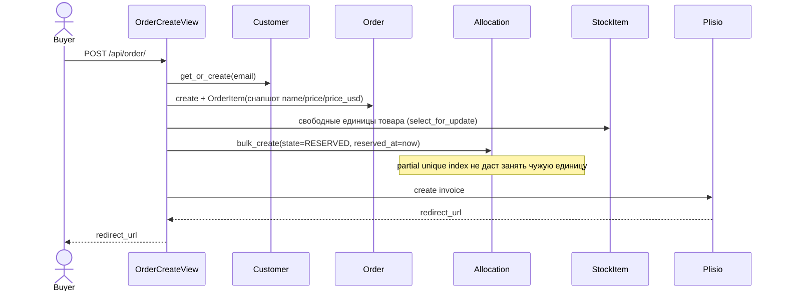
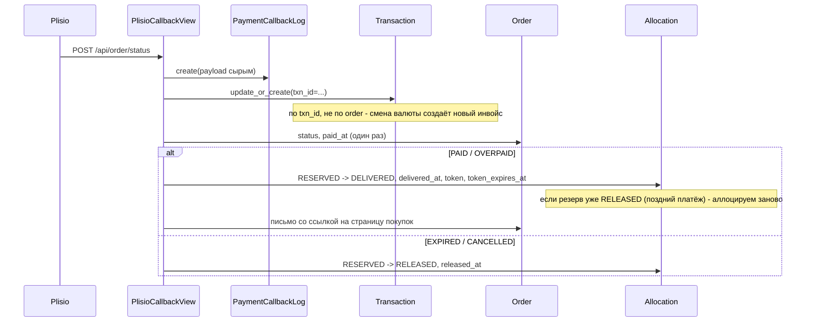
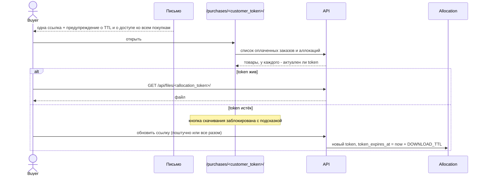
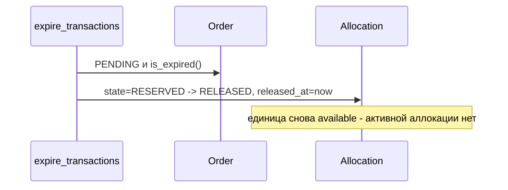

# Целевая схема

Решения, стоящие за схемой, записаны в [`docs/adr/`](../adr/). Термины — в
[`CONTEXT.md`](../../CONTEXT.md). Здесь только то, как это выглядит.

## Приложения

| Приложение | Модели | Было |
|---|---|---|
| `catalog` | `Country`, `Product`, `StockItem` | `passport` |
| `customer` | `Customer` | — |
| `sales` | `Order`, `OrderItem`, `Allocation`, `Transaction`, `PaymentCallbackLog` | `order` |
| `mailing` | `Broadcast`, `BroadcastDelivery` | коммит `883990c` удалённой ветки `feature/add-broadcasting` |

Исчезли: `DownloadLink`, `Unsubscribe`, `Passport.quantity`, `OrderItem.is_reserved`,
`passport/signals.py`, команда `resync_quantity`. Сами приложения `passport` и `order` вместе с
их таблицами дропнуты в R5 — см. [`r5.md`](./r5.md).

## Схема (DBML)

```dbml
// --- App: catalog ---

Table catalog_country {
  id integer [primary key]
  name varchar [note: "translated"]
  code varchar [null, note: "ISO код для флага; '-' если группа не страна"]
}

Table catalog_product {
  id integer [primary key]
  name varchar [note: "translated"]
  price_currency varchar
  price decimal
  country_id integer [ref: > catalog_country.id]
  // quantity удалён: остаток выводится запросом, см. ADR-0002
}

Table catalog_stockitem {
  id integer [primary key]
  file varchar [unique]
  product_id integer [null, ref: > catalog_product.id, note: "SET_NULL"]
  created_at datetime [note: "дата завоза; у строк до R4 - дата миграции"]
  // status удалён: состояние живёт на Allocation, см. ADR-0001
}

// --- App: customer ---

Table customer_customer {
  id integer [primary key]
  email varchar [unique]
  access_token uuid [unique, note: "открывает страницу покупок"]
  access_token_expires_at datetime
  language varchar [note: "en/ru, на этом языке уходят все письма, см. ADR-0009"]
  is_subscribed boolean [note: "заменил таблицу Unsubscribe"]
  unsubscribed_at datetime [null]
  created_at datetime
}

// --- App: sales ---

Table sales_order {
  id integer [primary key]
  customer_id integer [ref: > customer_customer.id]
  status varchar [note: "PENDING, PAID, OVERPAID, EXPIRED, ERROR, CANCELLED"]
  total_price_currency varchar
  total_price decimal
  created_at datetime
  updated_at datetime
  paid_at datetime [null, note: "ставится один раз при переходе в PAID"]
}

Table sales_orderitem {
  id integer [primary key]
  order_id integer [ref: > sales_order.id]
  product_id integer [null, ref: > catalog_product.id, note: "SET_NULL"]
  product_name varchar [note: "снапшот на момент покупки"]
  unit_price_currency varchar
  unit_price decimal [note: "снапшот в валюте товара"]
  unit_price_usd decimal [note: "снапшот по курсу момента чекаута"]
  quantity integer
}

Table sales_allocation {
  id integer [primary key]
  order_item_id integer [ref: > sales_orderitem.id]
  stock_item_id integer [null, ref: > catalog_stockitem.id, note: "SET_NULL"]
  state varchar [note: "RESERVED, DELIVERED, RELEASED"]
  reserved_at datetime
  delivered_at datetime [null]
  released_at datetime [null]
  token uuid [null, unique, note: "открывает один файл"]
  token_expires_at datetime [null]
  download_count integer [note: "пишет serve_allocation(), см. R4"]
  first_downloaded_at datetime [null]
  last_downloaded_at datetime [null]

  indexes {
    (stock_item_id) [unique, name: "one_active_allocation_per_stock_item"]
    // partial: WHERE state <> 'RELEASED'
  }
}

Table sales_transaction {
  id integer [primary key]
  order_id integer [ref: > sales_order.id, note: "FK, не OneToOne - см. ADR-0006"]
  txn_id varchar [unique, note: "id инвойса Plisio"]
  status varchar
  amount decimal
  currency varchar
  pending_amount decimal [null, note: "остаток к доплате"]
  tx_urls json [null, note: "массив блокчейн-транзакций"]
  source_price_currency varchar [null]
  source_price decimal [null]
  source_rate decimal [null]
  commission decimal [null]
  confirmations integer [null]
  merchant varchar [null]
  merchant_id varchar [null]
  comment varchar [null]
  created_at datetime
  updated_at datetime
}

Table sales_paymentcallbacklog {
  id integer [primary key]
  order_id integer [null, ref: > sales_order.id]
  txn_id varchar [null]
  payload json [note: "сырой callback как пришёл"]
  received_at datetime
}

// --- App: mailing ---

Table mailing_broadcast {
  id integer [primary key]
  subject_en varchar
  subject_ru varchar
  body_en text
  body_ru text
  test_email varchar [null]
  status varchar [note: "DRAFT, QUEUED, SENDING, SENT, FAILED"]
  created_at datetime
  sent_at datetime [null]
  // счётчиков нет: они считаются по mailing_broadcastdelivery
  // subject/body ведёт modeltranslation, как Country.name и Product.name
}

Table mailing_broadcastdelivery {
  id integer [primary key]
  broadcast_id integer [ref: > mailing_broadcast.id]
  customer_id integer [ref: > customer_customer.id]
  state varchar [note: "PENDING, SENT, FAILED"]
  error text [null]
  created_at datetime
  sent_at datetime [null]

  indexes {
    (broadcast_id, customer_id) [unique]
  }
}
```

## Инварианты

Держатся базой или структурой, а не аккуратностью кода:

1. **Один файл — один покупатель.** `UniqueConstraint(fields=["stock_item"],
   condition=~Q(state="RELEASED"))`. Гонка на резерве невозможна физически.
2. **`sum(unit_price_usd × quantity) == order.total_price`** — проверяется одним SQL.
3. **Выданная аллокация всегда имеет токен** — состояния «продано, но ссылки нет» не существует.
4. **«В наличии» выводится, а не хранится** — расходиться нечему.

## Потоки

### Чекаут и оплата



Если инвойс не создался — вся транзакция откатывается, аллокаций не остаётся.

### Callback



Поздний платёж (инцидент 652) перестаёт быть особым случаем: если аллокации освободились,
callback просто аллоцирует заново из текущего стока. Не хватило единиц — транзакция откатывается
целиком, заказ остаётся в исходном состоянии и callback можно повторить.

### Доступ покупателя



`Customer.access_token` ротируется при **любой** отправке письма — это механизм отзыва старых
ссылок. `Allocation.token` при этом не трогается, поэтому расшаренная ссылка на товар переживает
повторную покупку.

### Истечение резерва



## Настройки

```python
PURCHASES_PAGE_TTL = timedelta(hours=24)  # Customer.access_token
DOWNLOAD_TTL = timedelta(hours=24)        # Allocation.token
```
